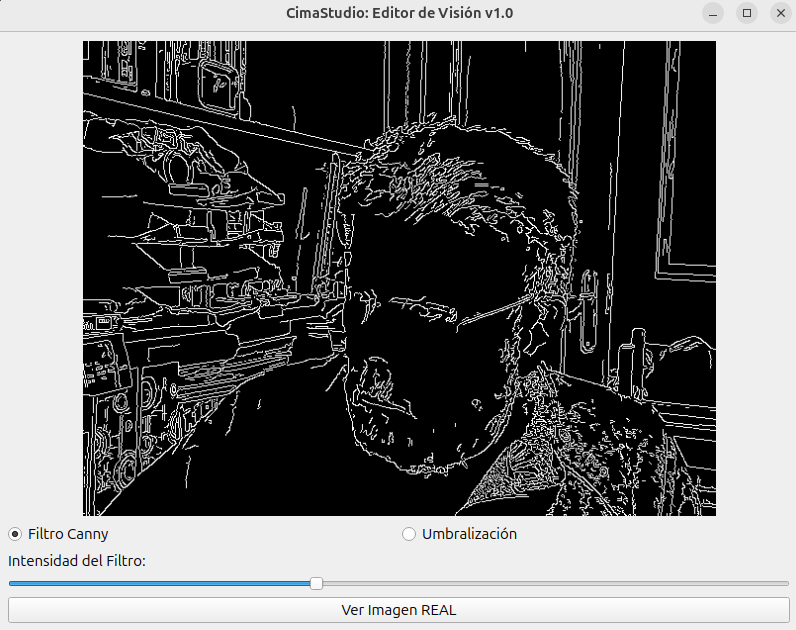

# CimaStudio 🏔️

**CimaStudio** es una aplicación de escritorio desarrollada en C++ que integra el poder de la visión artificial de **OpenCV** con la robustez de la interfaz gráfica de **Qt6**.

El proyecto sigue una filosofía de desarrollo descendente: desde la **cima** (la interfaz de usuario y abstracción) hasta la **base** (el manejo de memoria y procesamiento de datos).

<p align="center">
  
</p>

## 🚀 Características

*   **Arquitectura Híbrida**: Integración fluida de `Qt6::Widgets` para el control y `OpenCV` para el motor visual.
*   **Gestión Eficiente**: Uso de C++17 y el sistema `AUTOMOC` de Qt para una gestión de señales y slots moderna.
*   **Estructura Limpia**: Separación clara entre el punto de entrada, la definición de la interfaz y la lógica de implementación.

## 📖 Estructura del documento pdf (el tutorial)

1. Introducción: El arte de enseñar a ver a las máquinas
2. Anatomía Visual y Funcional de CimaStudio
3. La Ingeniería detrás de la Escena	12
4. Flujo de la Luz: La Arquitectura Base
5. Ampliación de Conceptos	22
6. 🧪 Anexo: El Laboratorio de CimaStudio
7. Horizontes de CimaStudio: El siguiente nivel

## 📁 Estructura del Proyecto (el código)

*   `main.cpp`: Punto de entrada de la aplicación y ciclo de vida de `QApplication`.
*   `cimastudio.h`: Definición de la clase principal, slots de Qt y estructura de la UI.
*   `cimastudio.cpp`: Lógica de negocio, integración con OpenCV y comportamiento de la aplicación.
*   `CMakeLists.txt`: Receta de construcción que gestiona las dependencias externas.

## 🛠️ Requisitos e Instalación

### Dependencias
Asegúrate de tener instalados:
*   **Qt6** (Widgets component)
*   **OpenCV** (Librerías de desarrollo)
*   **CMake** 3.10+
*   Compilador con soporte para **C++17**

### Compilación
```bash
mkdir build && cd build
cmake ..
cmake --build .
